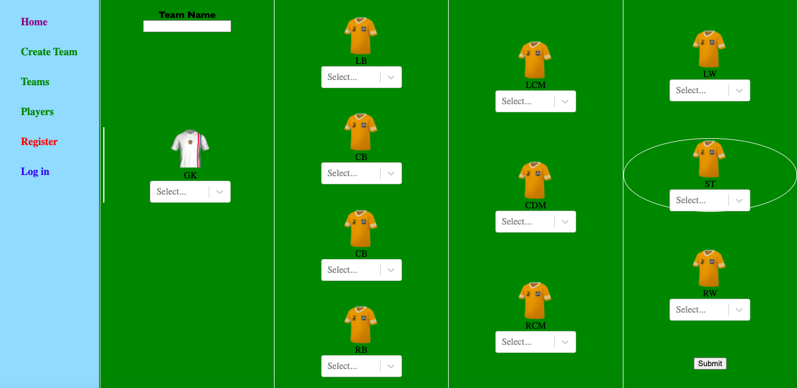

# SEI-Project-3

# Premier League Squads (1 week)

In this project I was tasked with building a MERN Stack APP.

 - MongoDB was used to create the database for the project and this was aided through the use of insomnia to easily access the information and to help with requests and responses.

 - Express was used to provide the basic features for developing a web app in Node.js.

 - React was used to handle the client-side Javascript framework making it easier for multi page applications.

 - Node was used to execute JavaScript outside of the browser on the server side.



URL - https://bit.ly/3pqre2H

### Dependencies:

In the root of the project yarn add: 
- bcrypt 
- concurrently
- express
- jsonwebtoken
- mongoose
- mongoose-unique-validator

In the client folder, yarn add:

- axios
- node-sass
- react
- react-dom
- react-router-dom
- react-select 

## General approach taken:

Upon being set this task I began thinking of something to build. As a football fan the ability to build and rate teams as well as being able to rate players performances seemed like a good idea for this project. After drawing out a plan of everything I would need I started on the backend.

### Back End

 Getting this fully set up and working before starting on the front end seemed the sensible option. After setting up the server and connecting to my mongo database I began to create my player and team schemas. After this I set about creating the structure for my incoming requests. Having done this and added a logger to make these requests more readable I set up my seeds so that I could pre populate my app with teams and players. This led to difficulties seeding team data with player ids that changed as well and later owners but I was able to work through them. I managed to find data on all of the premier league footballers and managed to cut this down to fit my own needs for how I wanted my data to be structured. I then moved out controllers into their own file and set up the error handling. I then set about creating a user model and dealing with login/ register requests as well as adding the user model to the team model and dealing with validating a user, making passwords cryptic, and dealing with web tokens. After finishing this I added the structure for displaying and receiving comments. After this I was able to begin on my front end.


```JavaScript
// comment and team models

const commentSchema = new mongoose.Schema({
  text: { type: String, required: true, maxlength: 80 },
  rating: { type: Number, required: true, unique: false, min: 1, max: 100 },
  owner: { type: mongoose.Schema.ObjectId, ref: 'User', required: true  },
}, {
  timestamps: true,
})

const teamSchema = new mongoose.Schema({
  name: { type: String, required: true, unique: true },
  goalkeeper: { type: mongoose.Schema.ObjectId, ref: 'Player', required: true  },
  defenders: [{ type: mongoose.Schema.ObjectId, ref: 'Player', required: true  }],
  midfielders: [{ type: mongoose.Schema.ObjectId, ref: 'Player', required: true  }],
  attackers: [{ type: mongoose.Schema.ObjectId, ref: 'Player', required: true  }],
  owner: { type: mongoose.Schema.ObjectId, ref: 'User', required: true  },
  comments: [commentSchema],
})
```

### Front End

Having initially been concerned for time I wanted to get the main functionality of the app down. It came apparent that rating individual players each time you submit wasn't key to the functionality so I decided to leave this to the end. I installed React-select which I used to handle the users request to create a team. Having set this up and creating the team index page I then set about creating the team show page. I then managed to crack the team seeding and was able to pre-populate teams and comments. Having made good time, I decided to go back and add an average rating schema to the team model. I then made the login and register pages and set about doing error handling on the front end. I then decided to add a players index page as I had time and was able to add a search bar to it and with it a player show page. I then as time was nearing the end created a home page and did final css improvements.

```JavaScript
// team submit logic

const handleSubmit = async event => {
    event.preventDefault()
    try {
      if (formdata !== '') {
        const teamData = {
          name: formdata.teamName,
          goalkeeper: formdata.goalkeeper,
          defenders: [formdata.playerTwo, formdata.playerThree, formdata.playerFour, formdata.playerFive],
          midfielders: [formdata.playerSix, formdata.playerSeven, formdata.playerEight],
          attackers: [formdata.playerNine, formdata.playerTen, formdata.playerEleven]
        }

        const teamDataWithIds = {
          ...teamData,
          goalkeeper: findPlayerIdByName(teamData.goalkeeper, players),
          defenders: teamData.defenders.map(name => findPlayerIdByName(name, players)),
          midfielders: teamData.midfielders.map(name => findPlayerIdByName(name, players)),
          attackers: teamData.attackers.map(name => findPlayerIdByName(name, players))
        }
        const { data } = await createTeam(teamDataWithIds)
        history.push(`/teams/${data._id}`)
      } else {
        throw new Error
      }
    } catch (err) {
      console.log(err)
      setIsError(true)
    }
  }
```

The approach I took to getting everything working in the backend first was very beneficial as it saved me running into extra problems in the front-end. As I did this project solo I just didn't have the time to take the idea to its fullest and still had lots of things to add in the future as I explain below. 


### Major hurdles and unsolved problems

Major hurdles that were overcome were seeding teams from player ids that change every time you seed as well as requiring owners that were also seeded. Managing to combine many select box's into the data stucture of the team model as well as handling errors from empty submits which would need to be improved given more time. Styling without the help of a css framework was also good practice.

In terms of unsolved problems there were lots that I could have added if I had more time. The ability to create players from the past or make them up is simple functionality that could add to the enjoyment of the app. Having more complex user relationships with messaging so you could have friends and groups and be able to post a team to specific users. Being able to rate players rather than teams so that you can rate lineups and player performances from real life. Perhaps access a live scores API to give users up to date scores and football news. All these would add to the complexity and enjoyment of the app.

### Wins

Wins included creating my first full stack application and becoming more confident with React.

### Key Learning

Key learning included the request response cycle, models, databasing, error handling, authorization and using forms and formdata.
